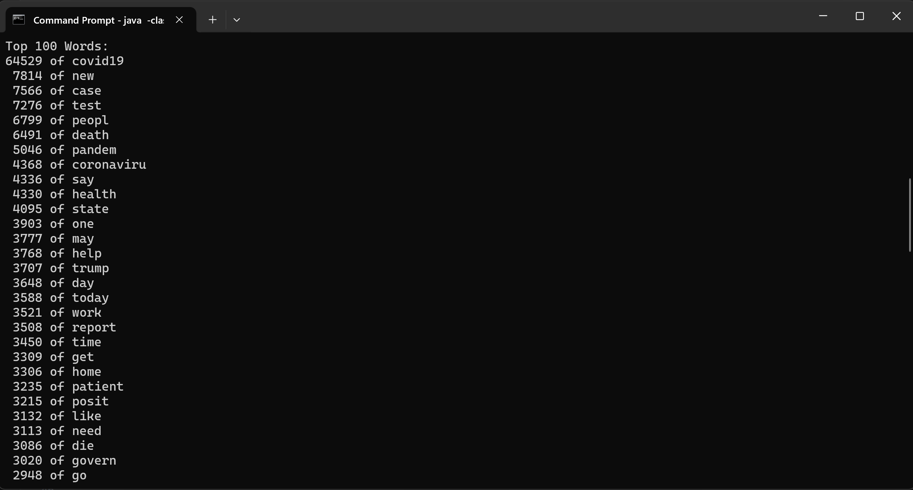
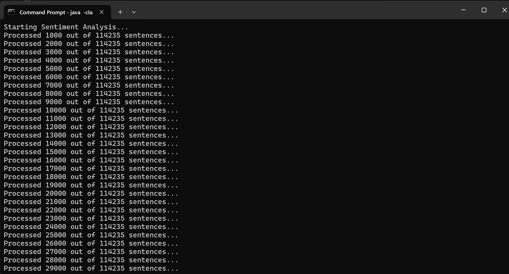
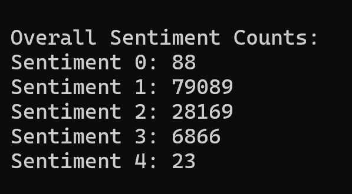

## My Program
**Sentiment_Analyzer** Is a program that will analyze the sentiments of a set of over 150,000 tweets about COVID-19 to analyze the changing public perception on the virus.

## WARNING
Program may take a while to clone into and will take **roughly** 30-35 minutes to run the full dataset given the extreme amount of tweets being analyzed.

## Important
You can run a smaller amount of tweets by modifying the temporal range (date range) in the Driver.java main method. The temporal range is located at the top of the main method and there are comments around it to make it easily visible. By modifying this value you can view how the public perception has changed over time and how the distribution of scores will change throughout the months.

## What it does
- This program is written in Java
- The program parses each individual tweet
- Utilizing the Stanford Core NLP program I analyze the sentiment of each tweet 
- I calculate the frequency each word has been used throuhgout all the tweets
- I calculate the number of tweets with each sentiment from 1-5

## How to run the program

1. **Simply clone the repository:**
   
   git clone https://github.com/dandob1/Sentiment_Analyzer.git

   cd into the folder

2. **Compile and run the project:**

    Use the following commands:

    - **Windows:**

        javac -classpath ".;.\stanford-corenlp-3.9.2.jar;.\ejml-0.23.jar;.\stanford-english-corenlp-2018-10-05-models.jar" *.java

        and

        java -classpath ".;.\stanford-corenlp-3.9.2.jar;.\ejml-0.23.jar;.\stanford-english-corenlp-2018-10-05-models.jar" Driver

    - **MacOS/Linux:**

        javac -classpath ".:./stanford-corenlp-3.9.2.jar:./ejml-0.23.jar:./stanford-english-corenlp-2018-10-05-models.jar" *.java

        and

        java -classpath ".:./stanford-corenlp-3.9.2.jar:./ejml-0.23.jar:./stanford-english-corenlp-2018-10-05-models.jar" Driver

## Example

**Your output should look something like this:**

- First the top 100 words should be printed:
    
    

- Next, a running count of how many of the sentences have been processed should be provided for every 1000 tweets:

    

- Finally, you will see the total number of tweets that have been ranked in each sentiment 1-5:

    